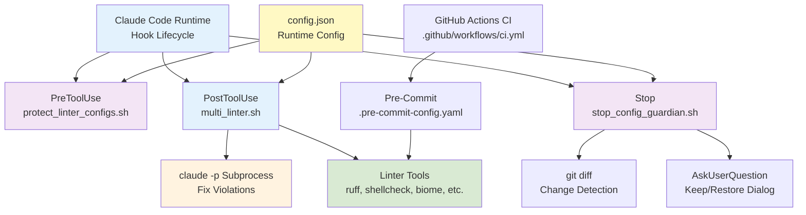
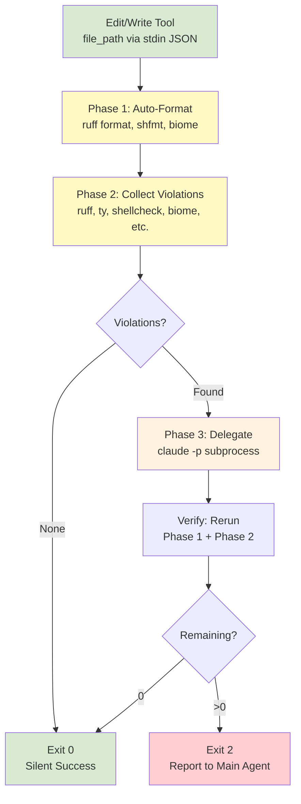
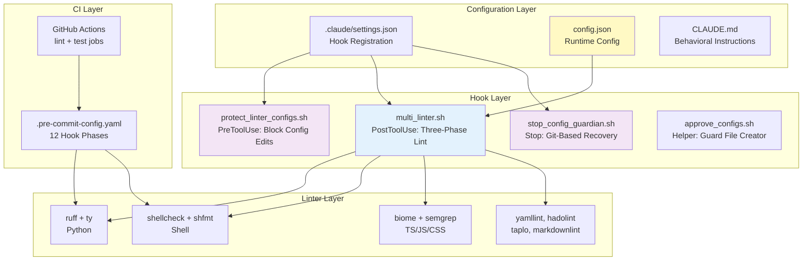

# Claude Code Hooks Portable Template - Architecture Overview

## TL;DR

- **Purpose**: Reusable template for automated code quality
  enforcement via Claude Code hooks
- **Scope**: Hook scripts (`.claude/hooks/`), linter configs,
  CI/pre-commit pipelines
- **Key responsibilities**:
  - Three-phase linting (format, collect, delegate)
    on every Edit/Write
  - Defense-in-depth config protection
    (PreToolUse block + Stop hook recovery)
  - Complexity-based model selection (haiku/sonnet/opus) for subprocess delegation
- **Languages**: Python, Shell, YAML, JSON, TOML, Markdown, Dockerfile, TypeScript/JS/CSS
- **Dependencies**: `jaq` + `ruff` required; 15+ optional
  linters skipped if absent

## Scope & Context

- **Goals**: Portable, zero-violation baseline with
  automated enforcement in CC sessions and pre-commit
- **Non-goals**: Runtime app code; IDE integration
  beyond Claude Code; custom linter rule authoring
- **Upstream**: Claude Code runtime (hook lifecycle:
  PreToolUse, PostToolUse, Stop); `claude -p` CLI
- **Downstream**: Adopting projects inherit hooks,
  linter configs, and CI pipeline
- **Operating model**: Bash scripts run synchronously;
  blocks main agent until complete

## System Overview

- **Three-phase linting**: Format -> Collect (JSON)
  -> Delegate + Verify
- **Config protection**: Two-layer defense (PreToolUse
  blocks edits; Stop hook detects via `git diff`)
- **Model routing**: Violation complexity drives
  haiku/sonnet/opus selection
- **Dual enforcement**: CC hooks (real-time) +
  pre-commit (commit-time) share linter configs
- **Graceful degradation**: Optional tools skipped
  if absent; only `jaq` and `ruff` required
- **Runtime configuration**: `config.json` controls
  language toggles, phase control, model patterns
- **Session-scoped tools**: jscpd and Semgrep run
  once per session after 3+ files modified
- **Boy Scout Rule**: CLAUDE.md enforces ownership
  of all violations in touched files

## Context Diagram

## Data Flow Diagram

## System Overview Diagram

## Core Components

### multi_linter.sh (PostToolUse Hook)

- **Location**: `.claude/hooks/multi_linter.sh` (~1,287 lines)
- **Responsibilities**:
  - Dispatches files to language-specific handlers based on extension
  - Runs three-phase lint: format, collect
    violations as JSON, delegate to subprocess
  - Manages session-scoped tools (jscpd, Semgrep) via `/tmp` marker files
  - Selects subprocess model (haiku/sonnet/opus) based on violation codes and count
- **Implementation**:
  - Reads `config.json` at startup for language toggles, phase control, model patterns
  - Collects violations into a JSON array with unified `{line, column, code, message, linter}` schema
  - Spawns `claude -p` with `--settings ~/.claude/no-hooks-settings.json` to prevent recursion
  - Verification pass re-runs Phase 1 + Phase 2 after subprocess exits
- **Inputs**: stdin JSON `{"tool_input": {"file_path": "..."}}` from Claude Code
- **Outputs**: Exit 0 (clean) or exit 2 + stderr message (violations remain)

### protect_linter_configs.sh (PreToolUse Hook)

- **Location**: `.claude/hooks/protect_linter_configs.sh` (~87 lines)
- **Responsibilities**: Blocks Edit/Write on protected config files and hook scripts
- **Implementation**: Extracts file path from stdin JSON, matches basename against `config.json` protected list or `.claude/` path patterns. Returns `{"decision": "block"}` or `{"decision": "approve"}`
- **Notes**: Fires on all Edit/Write operations; uses fast-path approval for non-protected files

### stop_config_guardian.sh (Stop Hook)

- **Location**: `.claude/hooks/stop_config_guardian.sh` (~158 lines)
- **Responsibilities**: Detects modified config files at session end; prompts user via AskUserQuestion to keep or restore
- **Implementation**: Programmatic detection via `git diff --name-only` (no LLM). Hash-based guard file (`/tmp/stop_hook_approved_${PPID}.json`) prevents re-prompting within same session. Uses `stop_hook_active` flag to prevent infinite loops
- **Notes**: `approve_configs.sh` helper creates guard file with SHA-256 content hashes

### config.json (Runtime Configuration)

- **Location**: `.claude/hooks/config.json` (~68 lines)
- **Responsibilities**: Central configuration for all hooks - language toggles, protected files, exclusions, phase control, subprocess model patterns, jscpd settings
- **Implementation**: Loaded by `load_config()` in `multi_linter.sh`; parsed with `jaq`. Falls back to hardcoded defaults if missing
- **Notes**: Environment variables (`HOOK_SUBPROCESS_TIMEOUT`, `HOOK_SKIP_SUBPROCESS`) override config values

### test_hook.sh (Debug/Test Utility)

- **Location**: `.claude/hooks/test_hook.sh` (~701 lines)
- **Responsibilities**: Comprehensive self-test suite covering all file types, model selection, TypeScript handling, config protection, and edge cases
- **Implementation**: `--self-test` flag runs automated tests using temp files with `HOOK_SKIP_SUBPROCESS=1` for deterministic results. Covers ~25 test cases including Dockerfile patterns, styled output, model selection, and TypeScript-specific tests gated on Biome availability

## Data Model

- **Violation schema**: `{line: number, column: number, code: string, message: string, linter: string}` - unified across all linters
- **Hook input**: `{"tool_input": {"file_path": string}}` from Claude Code via stdin
- **PreToolUse output**: `{"decision": "approve"|"block", "reason"?: string}`
- **Stop output**: `{"decision": "approve"|"block", "reason"?: string, "systemMessage"?: string}`
- **Guard file**: `/tmp/stop_hook_approved_${PPID}.json` with `{approved_at, files: {path: "sha256:hash"}}`
- **Session markers**: `/tmp/.jscpd_session_${PPID}`, `/tmp/.semgrep_session_${PPID}`, `/tmp/.biome_path_${PPID}`

## Operations

- **Environments**: Template designed for local development with Claude Code; CI via GitHub Actions (`lint` + `test` jobs)
- **Configuration**: `config.json` for hook behavior; `.claude/settings.json` for hook registration; `.claude/settings.local.json` for personal overrides (gitignored); individual linter config files in project root
- **Observability**: `HOOK_DEBUG_MODEL=1` outputs model selection; `HOOK_SKIP_SUBPROCESS=1` captures violations without delegation; `claude --debug "hooks" --verbose` for full debug; `--self-test` flag for automated validation
- **CI/CD**: GitHub Actions runs `uv run pre-commit run --all-files` (lint job) and `uv run pytest tests/` (test job) on push/PR to main
- **Package management**: `uv` for Python dependencies (`pyproject.toml`); `npm` for Node tools (biome, jscpd, markdownlint-cli2)

## Security & Privacy

- **Config immutability**: Two-layer defense prevents weakening linter rules (PreToolUse block + Stop hook recovery)
- **Subprocess isolation**: `--settings ~/.claude/no-hooks-settings.json` disables hooks in subprocesses; output discarded (`>/dev/null 2>&1`)
- **Security scanning**: Bandit (Python) and Semgrep (TS/JS) detect common vulnerabilities; excluded from test paths to reduce false positives
- **Path normalization**: `is_excluded_from_security_linters()` normalizes absolute paths via `CLAUDE_PROJECT_DIR` for consistent exclusion matching
- **Atomic file operations**: Settings file auto-creation uses `mktemp + mv` pattern for concurrent safety

## Performance & Capacity

- **Phase 1 target**: <500ms for auto-formatting (ruff format handles 250k lines in ~100ms)
- **Subprocess timing**: Haiku ~5s, Sonnet ~15s, Opus ~25s per delegation
- **Session-scoped tools**: jscpd and Semgrep deferred until 3+ files edited to avoid per-file overhead
- **Biome caching**: `detect_biome()` caches path in `/tmp/.biome_path_${SESSION_PID}` to avoid repeated discovery
- **Subprocess timeout**: 300s default (configurable via `HOOK_SUBPROCESS_TIMEOUT`); `timeout` command sends SIGTERM
- **Main agent blocking**: Hooks are synchronous; entire Phase 1-3 cycle blocks the main agent

## Resilience

- **Graceful degradation**: Each optional tool checked with `command -v` before invocation; skipped silently if absent
- **Fail-open**: `jaq` absence causes early exit 0 (not blocking); JSON parse failures default to empty arrays
- **Subprocess failures**: Non-zero exit logged as `[hook:warning]` but does not block the hook; verification pass follows regardless
- **Timeout handling**: Exit code 124 from `timeout` command detected and reported; fallback to no-timeout if `timeout` not installed (macOS: `brew install coreutils`)
- **Version tolerance**: hadolint version < 2.12.0 triggers warning but continues; jscpd handles both `.statistics` (4.0.7+) and `.statistic` (older) response formats
- **Guard file lifecycle**: PPID-scoped to prevent cross-session interference; hash mismatch triggers re-prompt

## Testing & Quality

- **Automated tests**: `test_hook.sh --self-test` covers ~25 cases: file type detection, model selection, config protection, TypeScript handling, fallback behavior
- **Pre-commit**: 12-phase pipeline mirrors CC hook phases; runs `uv run pre-commit run --all-files`
- **CI**: GitHub Actions runs pre-commit (lint) + pytest (test) on push/PR to main
- **Type safety**: Python targets 3.11+; ty type checker runs in Phase 2b; ruff with 50+ rule categories in preview mode
- **Shell quality**: ShellCheck with maximum enforcement (all optional checks enabled, extended dataflow analysis); shfmt for formatting
- **Zero-violation baseline**: Template ships with no violations; CLAUDE.md enforces Boy Scout Rule

## Dependencies & Contracts

| Dependency | Purpose | Notes |
| --- | --- | --- |
| `jaq` | JSON parsing in hooks | Required; Rust `jq` alternative |
| `ruff` | Python format + lint | Required; 30x faster than Black |
| `claude` CLI | Subprocess delegation | Required for Phase 3 |
| `ty` | Python type checking | Optional; Astral Rust-based |
| `shellcheck` | Shell linting | Optional; `shfmt` for formatting |
| `biome` | TS/JS/CSS lint + format | Optional; via npm/npx/pnpm/bun |
| `yamllint` | YAML linting | Optional; all 23 rules configured |
| `hadolint` | Dockerfile linting | Optional; >= 2.12.0 recommended |
| `taplo` | TOML format + lint | Optional; Rust-based |
| `markdownlint-cli2` | Markdown linting | Optional; two-layer enforcement |
| `semgrep` | Security scanning (TS/JS) | Optional; session-scoped advisory |
| `jscpd` | Duplicate detection | Optional; via npx, 5% threshold |
| `vulture` | Dead code detection | Optional; 80% confidence minimum |
| `bandit` | Security scanning (Python) | Optional; config in pyproject.toml |
| `uv` | Python package management | Used for `uv run` tool invocation |

## Risks, Tech Debt, Open Questions

- **Shell script size**: `multi_linter.sh` at ~1,287 lines is large for a single bash script; refactoring into per-language modules would improve maintainability
- **Fragile parsing**: yamllint, flake8, and markdownlint output parsed via `sed` regex; format changes in these tools could break violation collection
- **Blocking model**: Synchronous hook execution means Phase 3 subprocess (up to 300s) blocks the main agent entirely
- **Session state in /tmp**: PPID-scoped files (`jscpd_session`, `semgrep_session`, `biome_path`) rely on process hierarchy; unusual session restarts could cause stale markers
- **TypeScript disabled by default**: `config.json` has `typescript.enabled: false`; users must opt-in and install Biome separately
- **No Windows support**: Bash-based hooks require Unix-like environment
- **macOS `timeout`**: Requires `brew install coreutils`; falls back to no timeout if absent

## Glossary

- **Boy Scout Rule**: Policy that editing a file makes you responsible for all its violations, not just ones you introduced
- **Phase 1/2/3**: Auto-format (silent), collect violations (JSON), delegate to subprocess + verify
- **PostToolUse**: Claude Code hook lifecycle event fired after Edit/Write tool completes
- **PreToolUse**: Claude Code hook lifecycle event fired before Edit/Write tool executes; can block
- **Stop hook**: Claude Code hook lifecycle event fired when session ends; can block exit
- **Guard file**: PPID-scoped JSON in `/tmp` storing SHA-256 hashes of approved config file modifications
- **Session-scoped**: Tools (jscpd, Semgrep) that run once per session after a file count threshold
- **SFC**: Single-File Components (`.vue`, `.svelte`, `.astro`) - receive Semgrep-only coverage
- **Subprocess delegation**: Spawning `claude -p` to autonomously fix collected violations
- **Volume threshold**: Number of violations (default 5) above which opus model is selected
